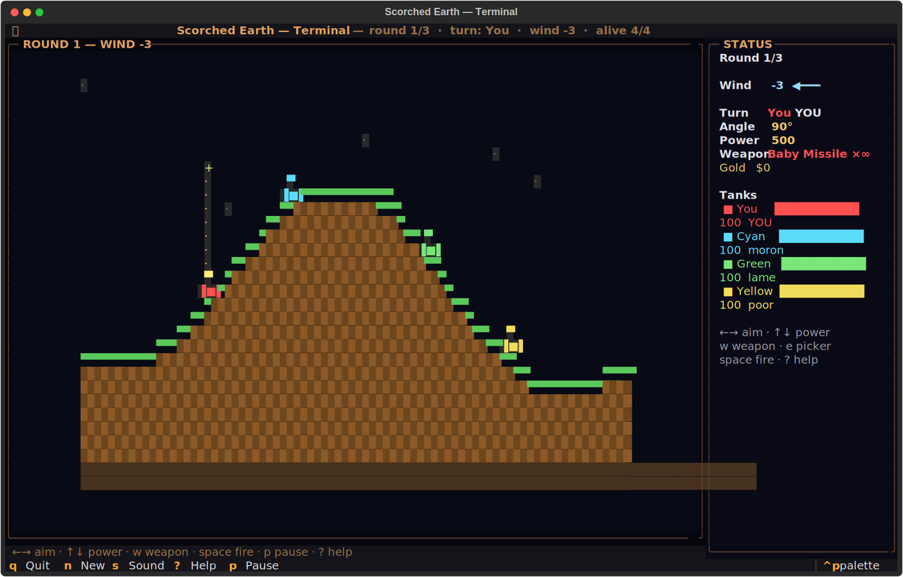
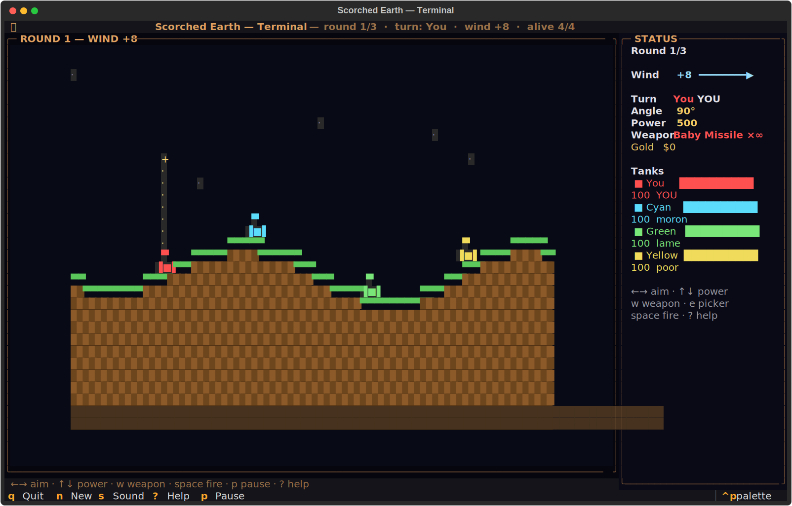
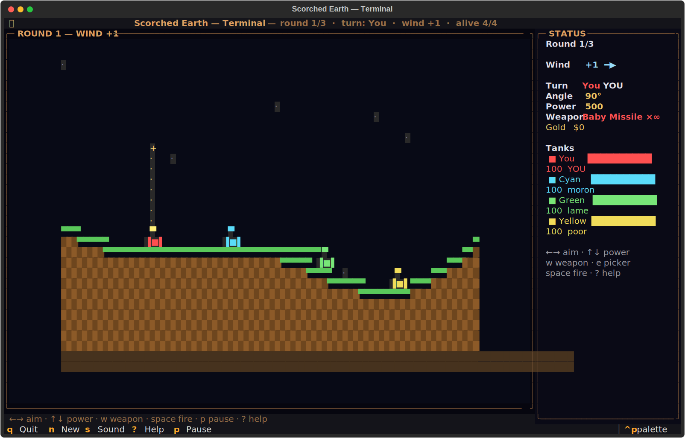

# ballisticarc-tui
Angle. Power. Fire.





## About
The mother of all games. Ten tanks on a procedural landscape. Pick an angle. Pick a power. Pick a weapon from a catalog of absurd ordnance and let fly. Wind drifts your shells. Gravity pulls them down. The terrain deforms around the impact. Clean-room terminal Scorched Earth — artillery comedy, unchanged.

## Screenshots


## Install & Run
```bash
git clone https://github.com/akakabrian/ballisticarc-tui
cd ballisticarc-tui
make
make run
```

## Controls
<Add controls info from code or existing README>

## Testing
```bash
make test       # QA harness
make playtest   # scripted critical-path run
make perf       # performance baseline
```

## License
MIT

## Built with
- [Textual](https://textual.textualize.io/) — the TUI framework
- [tui-game-build](https://github.com/akakabrian/tui-foundry) — shared build process
